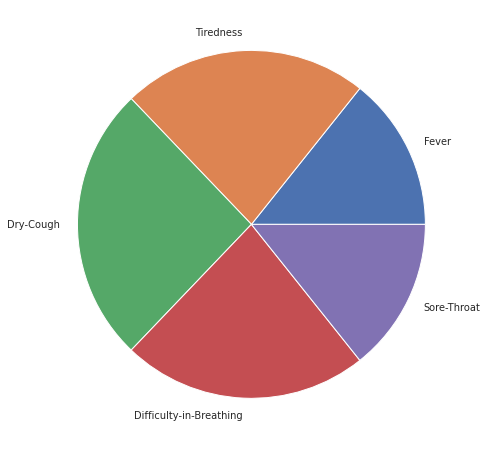

# Classifying Severity of Covid-19 Cases Using Machine Learning

The purpose of this project is to classify the severity levels of covid-19 cases into two class which is 'Severe' and 'Non-Severe'.

## Description

This classification of Covid-19 cases will be beneficial for providing adequate treatment to the patient based on the severity levels. With thorugh analysis of data, I have identified five main deciding symptoms i.e. fever, dry cough, tiredness, sore throat and difficulty in breathing which are responsible for deciding the severity of the case. In this project Logistic Regression is used for training the model and have achieved 75% accuracy. 

## Getting Started

### Dependencies

* There are no prerequisites for this program as it can directly be run using Google Colaboratory.

### Executing program

* you can directly open the file in google colab by clicking this button [](https://colab.research.google.com/github/rajsalla/Classifying-Covid-19-Cases/blob/main/Classifying_Covid_19_Cases.ipynb)
* If that does not work, you can download the [Classifying_Covid_19_Cases.ipynb](https://github.com/rajsalla/Classifying-Covid-19-Cases/blob/main/Classifying_Covid_19_Cases.ipynb) file and upload it to your google drive to run the program file.


* You need to download the dataset file [Cleaned-Data.csv](https://github.com/rajsalla/Classifying-Covid-19-Cases/blob/main/Cleaned-Data.csv) seperately.
* Mount your google drive which can be done by simply running this cell. You will be prompted to provide authentication code which you can obtain by signing in with your account.
```python
from google.colab import drive
drive.mount('/content/gdrive')
```
* Next, upload the dataset file to you google drive
 
* Next step is to modify the path of the dataset uploaded to your google drive.
```python
model_directory = '/content/gdrive/MyDrive/keggle/Cleaned-Data.csv'
```

* run the next cell or the following code to check if the dataset has been linked.

```python
df = pd.read_csv(model_directory)
display(df)
```
* If the dataset is displayed, you are ready to go ahead with the program!


## Data
There are several symptoms in the dataset of the Covid-19 cases but with the exploratory analysis, five major symptopms have been identified



## Training
For training the model, Logistic Regression Algorithm has been used. As our classification model is binary which predicts if the case is either severe or non-severe, the logistic regression model fits perfectly.
```python
lr = LogisticRegression()
lr.fit(x_train, y_train)
```
For Optimization, Principle Component Analysis (PCA) has been used. PCA is used to speed up the machine learning algorithm. PCA basically transforms the data based on the correlation of features to optimize the training.
```python
x = PCA(n_components = 3).fit_transform(x)
```

### Evaluation

Model is evaluated by comparing the predicted labels withe the true labels. accuracy_score from scikit learn library has been used to calculate the accuracy.
```python
y_pred = lr.predict(x_test)
y_true = y_test

from sklearn.metrics import accuracy_score
print("Train accuracy:", np.round(accuracy_score(y_train, 
                                                 lr.predict(x_train)), 2))
print("Test accuracy:", np.round(accuracy_score(y_true, y_pred), 2))
```
<b>Output: </b>
   ```
   Train accuracy: 0.75
   Test accuracy: 0.75
   ```

## Authors

Raj Salla
rsalla72@gmail.com
